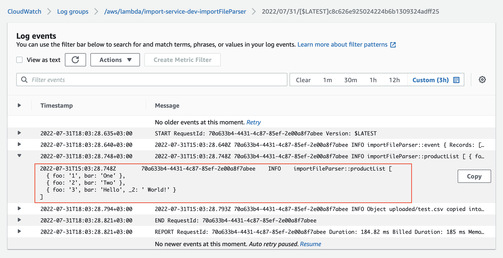

## Module 06: SQS & SNS, Async Microservices Communication
-[x] 1 - File serverless.yml contains configuration for catalogBatchProcess function
-[x] 2 - File serverless.yml contains policies to allow lambda catalogBatchProcess function to interact with SNS and SQS
-[x] 3 - File serverless.yml contains configuration for SQS catalogItemsQueue
-[x] 4 - File serverless.yml contains configuration for SNS Topic createProductTopic and email subscription

-[ ] +1 - catalogBatchProcess lambda is covered by unit tests
-[ ] +1 - set a Filter Policy for SNS createProductTopic in serverless.yml
(Create an additional email subscription and distribute messages to different emails depending on the filter for any product attribute)

CSV example
```cvs
title,description,imageUrl,price,count
"Incredible Rubber Computer","Carbonite web goalkeeper gloves are ergonomically designed to give easy fit",https://loremflickr.com/640/480/business?3343,867.00,98
"Elegant Frozen Cheese","The beautiful range of Apple Naturalé that has an exciting mix of natural ingredients. With the Goodness of 100% Natural Ingredients",https://loremflickr.com/640/480/business?80943,89.00,50
"Bespoke Wooden Gloves","New ABC 13 9370, 13.3, 5th Gen CoreA5-8250U, 8GB RAM, 256GB SSD, power UHD Graphics, OS 10 Home, OS Office A & J 2016",https://loremflickr.com/640/480/business?13970,635.00,80
"Ergonomic Bronze Salad","The beautiful range of Apple Naturalé that has an exciting mix of natural ingredients. With the Goodness of 100% Natural Ingredients",https://loremflickr.com/640/480/business?49348,695.00,1
"Refined Bronze Chips","The slim & simple Maple Gaming Keyboard from Dev Byte comes with a sleek body and 7- Color RGB LED Back-lighting for smart functionality",https://loremflickr.com/640/480/business?54089,615.00,83
"Recycled Metal Tuna","New ABC 13 9370, 13.3, 5th Gen CoreA5-8250U, 8GB RAM, 256GB SSD, power UHD Graphics, OS 10 Home, OS Office A & J 2016",https://loremflickr.com/640/480/business?54298,926.00,52
"Ergonomic Bronze Chair","Ergonomic executive chair upholstered in bonded black leather and PVC padded seat and back for all-day comfort and support",https://loremflickr.com/640/480/business?40559,648.00,59
"Electronic Frozen Soap","The beautiful range of Apple Naturalé that has an exciting mix of natural ingredients. With the Goodness of 100% Natural Ingredients",https://loremflickr.com/640/480/business?90934,814.00,84
"Ergonomic Cotton Salad","The Nagasaki Lander is the trademarked name of several series of Nagasaki sport bikes, that started with the 1984 ABC800J",https://loremflickr.com/640/480/business?47367,216.00,28
```

### Cloudfront
* [Website on Cloudfront](https://d2oxj55y64zodz.cloudfront.net/admin/products)


## Module 05: Integration with S3
* [GET `/import?name=test.csv` - get signed URL for S3 uploading](https://jkrxmfyj25.execute-api.us-east-1.amazonaws.com/dev/import?name=test.csv)
* File parsing results:

  `test.csv`
  ```cvs
    foo,bar
    1,One
    2,Two
    3,Hello, World!
  ```
  


### Cloudfront
* [Website on Cloudfront](https://d2oxj55y64zodz.cloudfront.net/)


## Module 04: Integration with Database

### API Gateway
* [GET `/products` endpoint to fetch a product list](https://jdpcg4ienj.execute-api.us-east-1.amazonaws.com/dev/products)
* [POST `/products` endpoint to add a new product](https://jdpcg4ienj.execute-api.us-east-1.amazonaws.com/dev/products)
* [GET `/products/{id}` endpoint to fetch an individual product](https://jdpcg4ienj.execute-api.us-east-1.amazonaws.com/dev/products/12f39fc4-e5fe-4785-8152-493dde93ee5f)

### Cloudfront
* [Website on Cloudfront](https://d2oxj55y64zodz.cloudfront.net/)


## Module 03: Serverless API

### API Gateway
* [`/products` endpoint to fetch a product list](https://jdpcg4ienj.execute-api.us-east-1.amazonaws.com/dev/products)
* [`/products/{id}` endpoint to fetch an individual product](https://jdpcg4ienj.execute-api.us-east-1.amazonaws.com/dev/products/28a50b67-3388-4512-bcea-10faf6d7bbfa)

### Cloudfront
* [PR to the my `shop-react-redux-cloudfront` repo](https://github.com/nodm/shop-react-redux-cloudfront/pull/2)
* [Page that uses `/products` endpoint](https://d2oxj55y64zodz.cloudfront.net/)
* [Page that uses `/products/{id}` endpoint](https://d2oxj55y64zodz.cloudfront.net/admin/product-form/28a50b67-3388-4512-bcea-10faf6d7bbfa)
